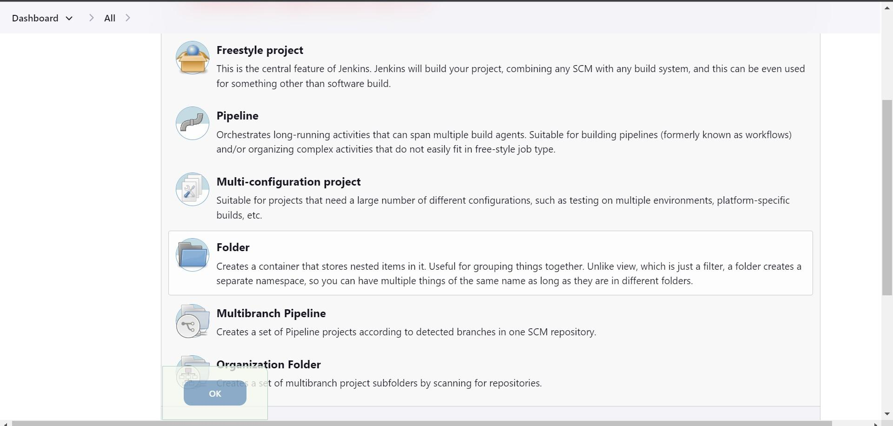

<h1>Table of Contents</h1>

1. [Project Objective](#Objective)
2. [Technologies used](#tech)
    2.1 [Selenium](#selenium)
    2.2 [Python](#python)
    2.3 [Jenkins](#jenkins)
    2.4 [Amazon EC2](#amazon)
3. [Overview](#overview)
    

<h2>Project Objective</h2>
Automation of CI/CD Tool : Jenkins (An open source automation server) using Selenium to reduce the number of errors that can take place in the many repetitive steps of CI and CD.

 

 
<h2>Technologies used</h2>

 
<h3>Selenium</h3>
 

 Selenium is an open-source tool that automates web browsers.The Selenium IDE provides a playback tool for authoring tests without the need to learn a test scripting language. It also provides a test domain-specific language (Selenese) to write tests in a number of popular programming languages, including C#, Groovy, Java, Perl, PHP, Python, Ruby and Scala. Selenium deploys on Windows, Linux, and macOS.

Selenium Integrated Development Environment (IDE) is the simplest framework in the Selenium suite and is the easiest one to learn. It is a Chrome and Firefox plugin that you can install as easily as you can with other plugins. However, because of its simplicity, Selenium IDE should only be used as a prototyping tool.

 
<h3>Python</h3>
 

 Python is a computer programming language often used to build websites and software, automate tasks, and conduct data analysis.The Selenium test scripts can be written in any programming languages like Java, Python, C#, Ruby, Perl, as so on. Python is very useful for automation testing because it supports multiple programming patterns.

It has many built-in testing frameworks such as Pytest and Robot, which covers the debugging and faster workflow. It is an interpreted language means the interpreter implements the code line by line at a time that's makes debugging easy.Python is Cross-platform Language, that's why it can run on different platforms like Windows, Linux, UNIX, and Macintosh.

 
<h3>Jenkins</h3>
 

 Jenkins is a continuous integration tool that enables continuous testing, build, and deployment of iterative code changes.It is an open-source automation tool written in Java with plugins built for continuous integration. Jenkins is used to build and test your software projects continuously making it easier for developers to integrate changes to the project, and making it easier for users to obtain a fresh build. It also allows you to continuously deliver your software by integrating with a large number of testing and deployment technologies.

With Jenkins, organizations can accelerate the software development process through automation. Jenkins integrates development life-cycle processes of all kinds, including build, document, test, package, stage, deploy, static analysis, and much more. Jenkins achieves Continuous Integration with the help of plugins. Plugins allow the integration of Various DevOps stages. If you want to integrate a particular tool, you need to install the plugins for that tool. For example Git, Maven 2 project, Amazon EC2, HTML publisher etc.

 
<h3>Amazon EC2</h3>
 

 Amazon Elastic Compute Cloud (EC2) is the Amazon Web Service you use to create and run virtual machines in the cloud. It is a web service that provides secure, resizable compute capacity in the cloud.It is designed to make web-scale cloud computing easier for developers. Amazon EC2's simple web service interface allows you to obtain and configure capacity with minimal friction. AWS provides reliable, scalable, and secure infrastructure resources that are ideal for running applications such as Jenkins. By running Jenkins on AWS compute, you only pay for what you use and you can scale capacity up or down to match your specific needs.

You can install Jenkins on an EC2 instance that is part of a public or a private subnet. If you want to place the instance in a private subnet you will need to make sure that you can access Jenkins’ front-end. If you are connecting through the internet you can opt to create a Jenkins target group and use an Application Load Balancer to create a public endpoint for your privately-hosted instance. If you are connecting from your own data center you will want to establish a VPN or connect to Jenkins through Direct Connect.
 

<h3>Overview</h3>
Jenkins is a platform for creating a Continuous Integration/Continuous Delivery (CI/CD) environment. The system offers many different tools, languages, and automation tasks to aid in pipeline creation when developing and deploying programs. In this project, we have automated Jenkins using Selenium webdriver. This tool is used for automating web-based application testing to verify that it performs expectedly. Selenium WebDriver allows you to choose a programming language to create test scripts. We have selected Python as our primary testing script language.

We hosted Jenkins on cloud using Amazon EC2 web server. The steps used to automate Jenkins were as follows :

<ol type="1">
  <li>Automated Jenkins login using username and password.</li>
  <li>Typed job name and selecting the job type among the 6 options provided on Jenkins.</li>
  <li>Built the selected job using the automation tool selenium.</li>
  </ol>

Thus, to brief it up , we automated selection and building of all the 6 job types in Jenkins to reduce human effort and the time to run repetitive tests from days to hours.

